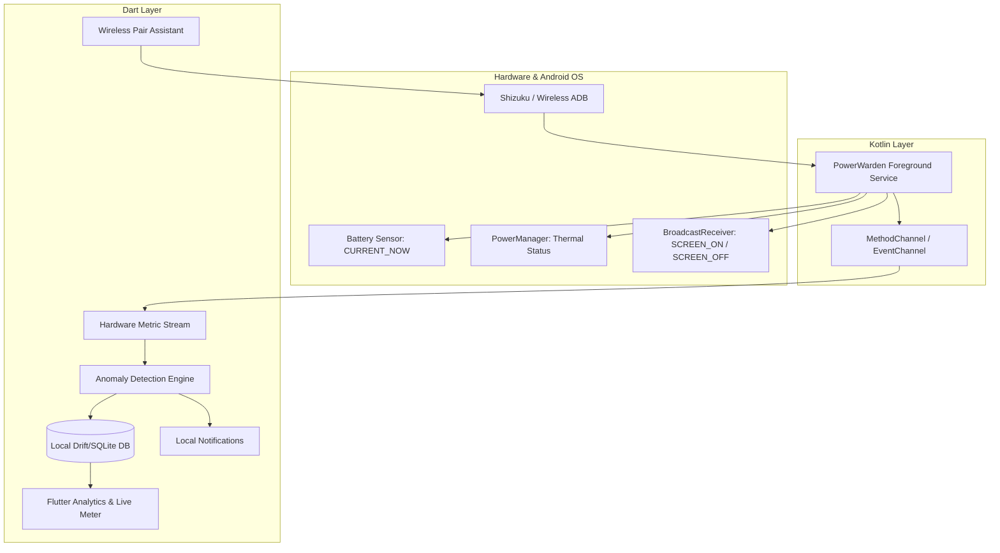

# PowerWarden ⚡🛡️

> **Intelligent Android Sentinel for Silent Battery Drain & Runaway Process Remediation**  
> Diagnoses and tames hidden high-drain system anomalies without requiring Root or a PC.

---

## 🌟 The Problem
On modern Android devices, background processes or system services can enter infinite execution loops (e.g. `system_server`'s `CpuTracker`, misbehaving push workers, or stuck binder IPC calls). 

Because Android’s SELinux policy blocks unprivileged apps from inspecting `/proc/<pid>/` or querying process-level CPU tables, users experience rapid battery drain (10–25%/hr while idle), thermal buildup, and device throttling with **zero explanation in standard system battery settings**.

## 🎯 The Solution
**PowerWarden** uses a dual-tier approach:
1. **Tier 1 (Zero-ADB, Zero-Root):** Uses physical hardware feedback—instantaneous battery discharge current (`BATTERY_PROPERTY_CURRENT_NOW` with OEM scale/sign calibration), thermal status changes (`PowerManager.OnThermalStatusChangedListener`), and battery drain velocity during screen-off states—to detect runaway drain instantly.
2. **Tier 2 (On-Device Shizuku / Wireless Debugging):** Leverages Android 11+ on-device Wireless Debugging (paired via Shizuku or direct in-app Kadb) to execute elevated differential diagnostics (`dumpsys batterystats`, `top`) to pinpoint the **exact runaway process or thread** and offer one-tap remediation.

---

## 🏗️ Architecture Overview

---

## 🚀 Key Features

* **Real-time Discharge Current Meter:** Direct read of instantaneous milliampere consumption ($mA$) with auto-calibrated vendor unit/sign detection.
* **Screen-off Drain Sentinel:** Monitors battery drop rate specifically while the device is sleeping. If drain exceeds $500mA$ continuously or $>4\%/hr$ while the screen is off, a high-severity alert is dispatched.
* **Thermal Corroborator:** Correlates unexpected discharge spikes with thermal throttling states (`THERMAL_STATUS_MODERATE`, `SEVERE`) to filter out false positives.
* **Rootless Deep Inspection (Shizuku & Kadb):** Extracts thread-level CPU usage and unreleased partial wakelocks without a PC or root permissions.
* **Differential Snapshotting:** Compares 5-10 second CPU/wakelock deltas at the moment of spike to find what's active right now, rather than cumulative stats.
* **Actionable Remediation:** One-tap action to force-stop or background-restrict rogue apps, or recommend reboots for stuck kernel/system loops.
* **Adaptive Zero-Wake Budget:** Relies on inexact alarms and in-memory batching ($<0.2\%$ battery overhead per 24h).

---

## 📂 Documentation

* [Development & Implementation Plans](PLANS.md)
* [Technical Architecture Specification](ARCHITECTURE.md)

---

## 🛠️ Tech Stack

* **Frontend:** Flutter (Dart 3.x), Material 3, `fl_chart`
* **Native Android:** Kotlin, Android Foreground Service (`specialUse`), BroadcastReceivers
* **Storage:** Drift (SQLite)
* **Privileged APIs:** Shizuku API (`dev.rikka.shizuku:api:13.1.5`) & Kadb (`com.flyfishxu:kadb:2.1.4`)
* **Background Execution:** `flutter_foreground_task`
